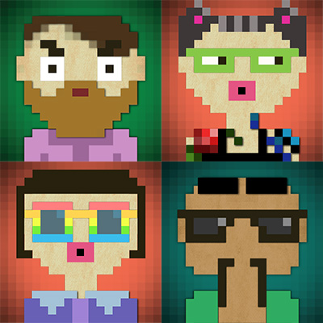

# GOvatar
[](https://godoc.org/github.com/o1egl/govatar)



## Overview

GOvatar is an avatar generator writen in GO

## Install

To install the library and command line program, use the following:

```
$ go get -u github.com/o1egl/govatar/...
```

[Binary packages](https://github.com/o1egl/govatar/releases) are available for Mac, Linux and Windows.

## Usage

```bash
    $ govatar generate male -o avatar.png     # Generates random avatar.png for male
    $ govatar generate female -o avatar.png   # Generates random avatar.png for female
    $ govatar -h                                 # Display help message
```

#### As lib

Generates avatar and save it to file

```go
    govatar.GenerateFile(govatar.MALE, "/path/to/file")
````

Generates avatar and return it as image.Image

```go
    img, err := govatar.Generate(govatar.MALE)
````


## Copyright, License & Contributors

### Adding new skins

1. Add new skins to data/background, male/clothes, female/hair and etc...
2. Run ``$ go-bindata -nomemcopy -pkg govatar data/...`` for building embedded assets.
3. Submit pull request :)

### Submitting a Pull Request

1. Fork it.
2. Create a branch (`git checkout -b my_branch`)
3. Commit your changes (`git commit -am "Added new awesome avatars"`)
4. Push to the branch (`git push origin my_branch`)
5. Open a [Pull Request](https://github.com/o1egl/govatar/pulls)
6. Enjoy a refreshing Diet Coke and wait

GOvatar is released under the MIT license. See [LICENSE](LICENSE)
